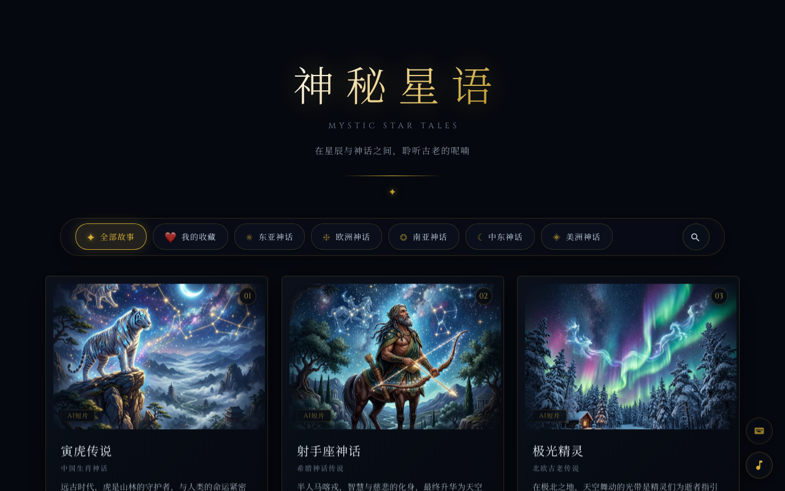
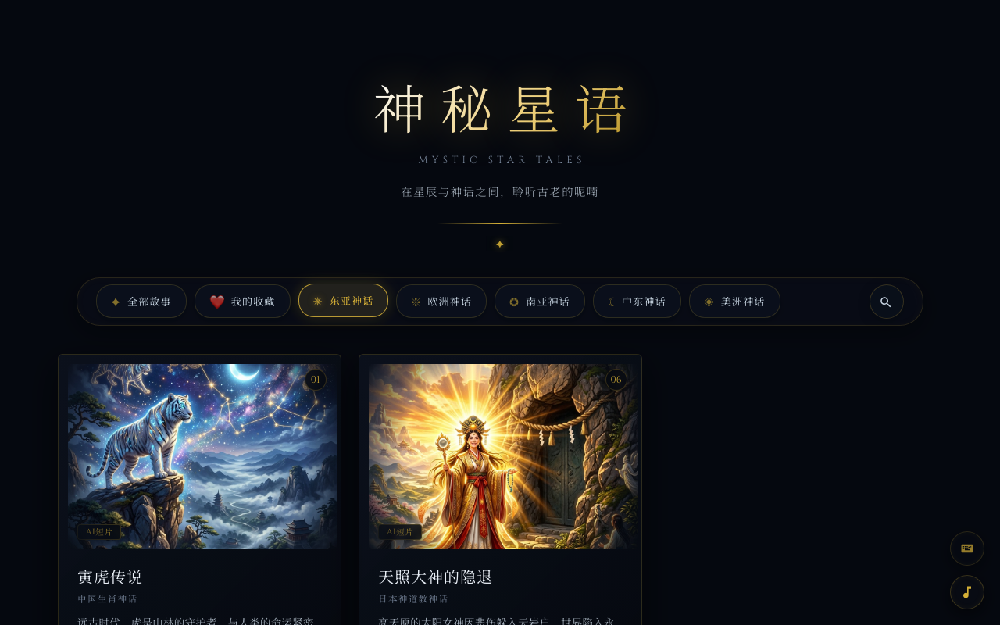
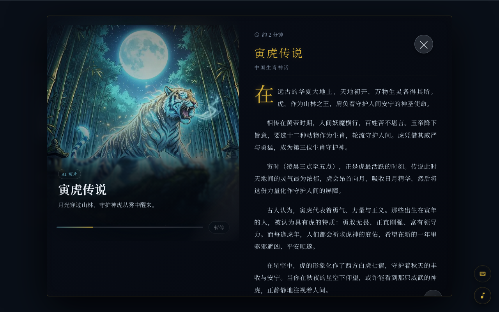
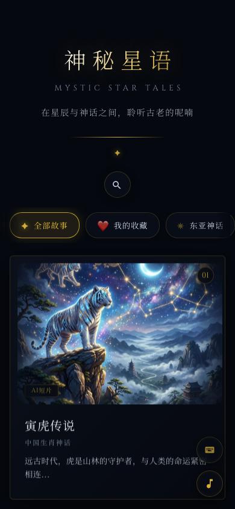
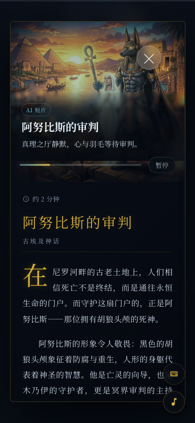

# ✦ 神秘星语 | Mystic Star Tales

<div align="center">

A Cozy Mythic Story PWA Web Application. Built with Vanilla JS & Canvas Physics.

[](LICENSE)
[](CHANGELOG.md)
[](#)
[](#)

[Demo](https://14sword.github.io/mystic-star-tales/) · [Changelog](CHANGELOG.md) · [Contributing](CONTRIBUTING.md)

</div>
### 🖥️ Desktop UI / 电脑端界面

| 🌌 主页预览 (Home) | 🔍 分类与检索 (Filters) | 📖 故事阅读 (Modal) |
| :---: | :---: | :---: |
|  |  |  |

### 📱 Mobile UI / 移动端界面

| 🌌 移动端主页 (Mobile Home) | 📖 移动端阅读 (Mobile Modal) |
| :---: | :---: |
|  |  |


---

## ✨ Features

### 📖 Content & Organization
- **15 World Mythology & Classic Tales**: Explore distinct mythic stories covering Chinese zodiac, Greek constellations, Norse aurora, Egyptian Anubis, time-transcending romance, and more.
- **Story Category Filters**: Easily filter stories by region (East Asia, Europe, South Asia, Middle East, Americas) using a modern glassmorphic filter bar.
- **Reading Progress Viz**: View estimated reading time and see a progress bar dynamically fill as you scroll.
- **Mythic Timeline**: A drawer timeline that anchors all 15 stories to their corresponding historical eras.

### 🎨 Visual & Audio Experience
- **Premium Glassmorphic UI**: Refactored cards interface leveraging CSS glassmorphism, nested border radii, and hover-zoom transitions.
- **Cursor Flashlight Glow**: Re-enabled interactive cursor-tracking flashlight glow within card regions.
- **3D Card Rotation**: Move your mouse across card boundaries to tilt them dynamically in 3D.
- **Physics Canvas Backgrounds**: Multi-layered starfields, falling sands, and trailing mouse particles active in the background.
- **Web Audio Sound Effects**: Ambient space drone generator and subtle click/hover audio effects synthesized directly in code.

### ⌨️ Navigation & Access
- **Keyboard Cheatsheet Drawer**: Press `?` to toggle a panel detailing keyboard shortcut commands.
- **Interactive keyboard support**: `←` / `→` arrow keys navigation, `Enter` to open, and `Esc` to close modal overlays.
- **Mobile Touch Enhancements**: Pre-configured swipe gestures and touch feedbacks optimized for iOS & Android.

### 🛰️ Offline & Cloud Architecture
- **PWA offline-first**: Installable shell with pre-cached assets (`sw.js`) and background stale-while-revalidate fetching.
- **Local DB Layer**: Mirrors preferences, bookmarks, ratings, and stats locally using IndexedDB (no network required).
- **Optional Supabase Cloud Sync**: Pre-wired Magic Link authentication and cloud storage sync schema.
- **Optional AI Image generation**: Front-end client to dispatch generation prompts to OpenAI-integrated Edge Functions.

---

## 📂 Project Structure

```text
mystic-star-tales/
├── index.html                       # 主 HTML 页面骨架
├── offline.html                     # PWA 离线降级备用页面
├── sw.js                            # Service Worker 离线高兼容预缓存注册表
├── manifest.json                    # PWA 应用清单配置文件
├── LICENSE                          # MIT 开源协议证书
├── README.md                        # 项目官方说明文档
├── .gitignore                       # Git 忽略文件配置
├── CHANGELOG.md                     # 版本迭代发布历史记录
├── CONTRIBUTING.md                  # 开发者贡献指南
├── css/                             # 样式设计系统目录
│   ├── reset.css                    # 基础样式重置
│   ├── variables.css                # 核心设计变量（色彩、间距、毛玻璃属性）
│   ├── background.css               # 背景物理动效层专有样式
│   ├── cards.css                    # 首页故事卡片交互样式
│   ├── modal.css                    # 故事详情模态弹窗样式
│   ├── main.css                     # 主页面容器布局样式
│   ├── clean-ui.css                 # 高级毛玻璃卡片视觉覆盖样式
│   └── styles.min.css               # 生产环境自动化合并压缩后的一体化 CSS
├── js/                              # 模块化 JavaScript 逻辑目录
│   ├── page-loader.js               # 首屏骨架屏加载动画与过渡
│   ├── deferred-loader.js           # 核心：空闲时间（Idle-time）非关键模块延迟加载协调器
│   ├── cards-data.js                # 静态结构化故事大纲数据
│   ├── app-config.js                # 本地/云端 Supabase 配置加载器
│   ├── app-event-bus.js             # 解耦发布订阅通信总线
│   ├── storage-migration.js         # 历史本地存储兼容性迁移适配器
│   ├── asset-service.js             # 本地静态资源映射与 Service Worker 同步服务
│   ├── cards-render-optimized.js    # 卡片网格实时绘制、3D 边缘悬停倾斜特效
│   ├── modal-optimized.js           # 故事详情阅读器弹窗、移动端滑动手势关闭逻辑
│   ├── image-loader.js              # 图片渐进式毛玻璃预加载（Progressive Blur-up）
│   ├── starfield-optimized.js       # Canvas 背景物理星轨物理轨迹渲染器
│   ├── cursor-light.js              # 鼠标手电筒光晕轨迹跟随特效
│   ├── effects.js                   # Canvas 流沙与粒子动效交互引擎
│   ├── main-optimized.js            # 主程序调度装配总线
│   ├── story-favorites.js           # 延迟加载：书签与故事收藏管理
│   ├── story-rating.js              # 延迟加载：故事本地星级评分交互
│   ├── story-notes.js               # 延迟加载：故事阅读笔记暂存器
│   ├── story-search.js              # 延迟加载：首字母及模糊检索故事模块
│   ├── story-filter.js              # 延迟加载：神话源流地区分类筛选逻辑
│   ├── audio.js                     # 延迟加载：Web Audio API 界面交互音效合成器
│   ├── ambient-music.js             # 延迟加载：Web Audio 空间环境氛围音乐播放器
│   ├── reading-progress.js          # 延迟加载：阅读卷轴进度高亮和阅读时间预估
│   ├── keyboard-hints.js            # 延迟加载：键盘快捷键抽屉面板组件
│   └── achievement-system.js        # 延迟加载：里程碑勋章成就记录与弹窗系统
├── assets/                          # 媒体静态资源目录
│   ├── ambient-space.mp3            # 100% 浏览器兼容的高品质环境氛围音乐
│   ├── icons/                       # PWA 应用入口桌面图标
│   ├── images/                      # 10 个主线故事的高清固定 jpg 主题封面图
│   └── generated/                   # 预置 of 离线分镜 WebP 动画帧目录及资产清单
├── tools/                           # 自动化辅助工具链目录
│   ├── build-css.mjs                # 轻量级 CSS 合并与混淆打包构建脚本
│   ├── generate-ai-intro-assets.mjs # 离线 AI 可视化分镜图像清单生成器
│   ├── verify-static.mjs            # 静态链接死链自动化检测校验脚本
│   └── take_screenshots.py          # 基于 Playwright 的全尺寸网站截图捕捉脚本
└── supabase/                        # 可选云同步后端配置目录
    ├── schema.sql                   # 数据库迁移结构及安全策略规则
    └── functions/                   # OpenAI Edge Functions AI 绘图/视频生成网关
```

---

## 🛠 Tech Stack

- **Core**: Vanilla HTML5 / CSS3 / ES6+ JavaScript
- **Animations**: HTML5 Canvas / requestAnimationFrame API
- **Audio**: Web Audio API
- **Database**: IndexedDB / LocalStorage
- **PWA**: Service Worker / Web App Manifest
- **Backend (Optional)**: Supabase / Edge Functions

---

## 🚀 Installation & Usage

### Clone Repository
```bash
git clone https://github.com/your-username/mystic-star-tales.git
cd mystic-star-tales
```

### Run Locally
Since this is a static offline-first app, you can run it with any simple local web server to test PWA capabilities (like Service Workers):

#### Python
```bash
python3 -m http.server 8000
```

#### Node.js
```bash
npx http-server -p 8000
```
Open your browser and navigate to `http://localhost:8000`.

---

## 🚢 Optional Cloud Configuration

To enable online Magic Link login and AI Image generation:

1. Copy `js/app-config.example.js` to `js/app-config.js` and fill in your Supabase configuration:
   ```javascript
   window.MYSTIC_APP_CONFIG = {
       supabaseUrl: 'https://your-project.supabase.co',
       supabaseAnonKey: 'your-anon-key',
       aiGenerationEnabled: true
   };
   ```
2. Initialize database schema using `supabase/schema.sql`.
3. Deploy the Edge Functions found in `supabase/functions/` to your project and configure `OPENAI_API_KEY` in Supabase.
4. Detailed setup steps can be found in `docs/DEPLOYMENT.md`.

---

## 📄 License

This project is licensed under the MIT License - see the [LICENSE](LICENSE) file for details.
